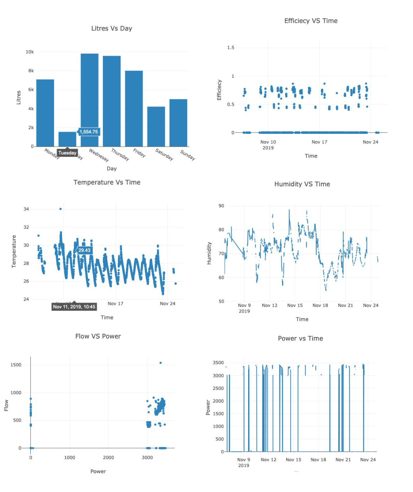

# PumpMonitoringSystem
ESW Course Project.

## Getting Started
In order to avoid possible merge conflicts and using git to its maximum advantage. Please follow these [guidelines](https://akrabat.com/the-beginners-guide-to-contributing-to-a-github-project/). Add all project requirements in issues for better tracking.

## Objective 
To design a robust pump monitoring system through which user can know about the status of their water pump.  

## Scope 
This project is meant to be used by people who want to monitor their pump’s power, energy vs flow, temperature and humidity of the area and provide appropriate analytics based on the data collected. This will be useful in areas where we have limited power supply and have to critically manage energy. Also we will be able to detect power failures and compromises to the pump performance.

## Setup 
# Software component
>> Connect the laptop to the hardware setup (built above)
>> Open Arduino and download the drivers required for uploading the code on the board. Also download the required header files. (refer the documentation specific to your operating system) >> Open the main.ino file provided.
>> Change the WiFi SSID and password to that of your network.
>> For intra-college network, use http and for other networks, use https in the server link.
>> Compile and upload it. If in case, you face any issues while uploading it, press the reset button on the board during the loading time.
>> Open the serial monitor. You should be able to see WiFi connected, and the values read by the board, and sent to the server.
>> Your setup is now ready for deployment.

# Deployment 
>> Insert the hardware component into a box, with 2 holes, one for temperature sensor, and other for connection wires from energy meter and flow meter to pass through.
>> Place it in a place where the WiFi signal is strong enough.
>> Connect it to the power supply.
>> Now the board shall send values to the servers as required. Leave the setup there for several days in order to get the data for a reasonable number of days.

# Experimental Results

